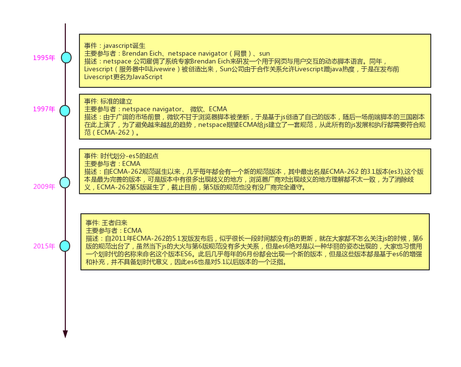
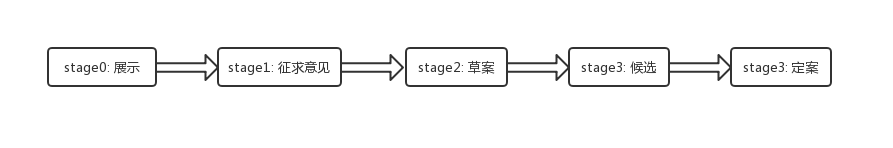

# javascript起源 #

　　关于JavaScript历史,最主要的是需要了解几个点：1.为什么要js；2.js什么时候诞生的；3.js的标准化；下图是关于这几个知识点的图形化描述

　　ECMA(European Computer Manufactures Association：欧洲计算机制造联合会)是个一个强大的组织,具体参与js规范制定的是一个叫TC39的工作小组,该小组主要参与的是ECMA-262协议的制定。ECMA-262协议约束范围如下：
1. 语法
2. 基本类型
3. 对象
4. 函数
5. 关键字

　　ECMA-262协议自2015年起基本会在每年6月发布一个版本,每个版本都会有新的变化,一个新的提案的发布流程如下图所示：

正常情况下进入stage2后的提案最终都会被通过定案

下一篇： [javascript现在](./es6.md)